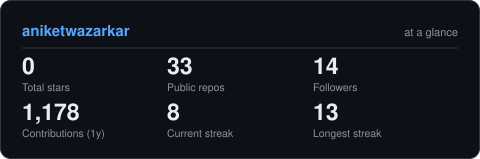

<div align="center">


<a href="https://linkedin.com/in/aniketwazarkar"></a>
<a href="mailto:wazarkar.aniket1@gmail.com"></a>
<a href="https://aniketwazarkar.in"></a>


</div>

---

## `~/` whoami

```console
$ cat about.txt
```

Software Development Engineer with 3+ years across backend and frontend, currently building scalable
microservices and WebSocket infrastructure at **Smallcase**.

- Currently building **financial microservices** at [Smallcase](https://smallcase.com)
- Portfolio: **[aniketwazarkar.in](https://aniketwazarkar.in)**
- Focused on **distributed systems, real-time infra, and root-cause automation**
- Resume: **[view it here](https://drive.google.com/file/d/1RAuuypFdDH4iDq_BBv86a_xJ7kRvOhDP/view?usp=sharing)**

<br>

<div align="center">

## `~/` toolbox


</div>

---

## `~/` journey

- **Smallcase** *(Sept 2025 – Present)* — SDE, financial microservices & WebSocket infrastructure
- **Jio** *(Oct 2023 – Sept 2025)* — SDE on JioMeet+, Jio Workspace, in-house media engines; built system sharding and Bloom filter optimizations
- **Capgemini** *(June 2022 – April 2023)* — Data Engineer Intern, Python/SQL data pipelines

---

<div align="center">

## `~/` skill radar

<table>
<tr>
<td width="50%" align="center" valign="middle">

<!-- Self-rated - edit assets/skills.json, the workflow redraws it -->
<picture>
  <source media="(prefers-color-scheme: dark)"  srcset="assets/radar-dark.svg">
  <source media="(prefers-color-scheme: light)" srcset="assets/radar-light.svg">
  
</picture>

</td>
<td width="50%" align="center" valign="middle">

<!-- Live, built from real language byte counts across my repos -->
<picture>
  <source media="(prefers-color-scheme: dark)"  srcset="assets/radar-langs-dark.svg">
  <source media="(prefers-color-scheme: light)" srcset="assets/radar-langs-light.svg">
  
</picture>

</td>
</tr>
</table>

</div>

---

<div align="center">

## `~/` contribution calendar

<!-- 3D isometric calendar, regenerated every 6h by .github/workflows/metrics.yml -->


<br><br>

<picture>
  <source media="(prefers-color-scheme: dark)"  srcset="https://raw.githubusercontent.com/aniketwazarkar/aniketwazarkar/output/snake-dark.svg">
  <source media="(prefers-color-scheme: light)" srcset="https://raw.githubusercontent.com/aniketwazarkar/aniketwazarkar/output/snake-light.svg">
  
</picture>

</div>

---

<div align="center">

## `~/` the numbers

<!-- Self-hosted stat card - stars/repos/followers/streaks pulled live from
     the API, not hardcoded. Own-repo replacement for github-readme-stats,
     whose shared public instance goes down under load. -->
<picture>
  <source media="(prefers-color-scheme: dark)"  srcset="assets/card-stats-dark.svg">
  <source media="(prefers-color-scheme: light)" srcset="assets/card-stats-light.svg">
  
</picture>

<br>


<br><br>


</div>

---

<div align="center">

## `~/` selected work

<!-- Cards generated by scripts/cards.py from assets/projects.json.
     Stars, forks and language are pulled live from the API on every run.
     Fill in your own repos in assets/projects.json before this section
     will render anything. -->

</div>

<sub>Selected work renders once `assets/projects.json` lists real repos — see the file for the format.</sub>

---

<div align="center">

*Thanks for stopping by — feel free to connect or collaborate.*

</div>
